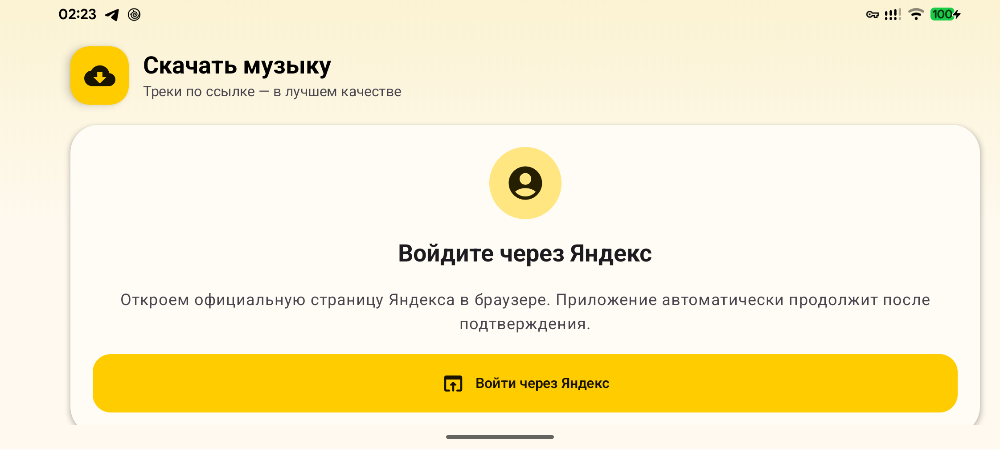
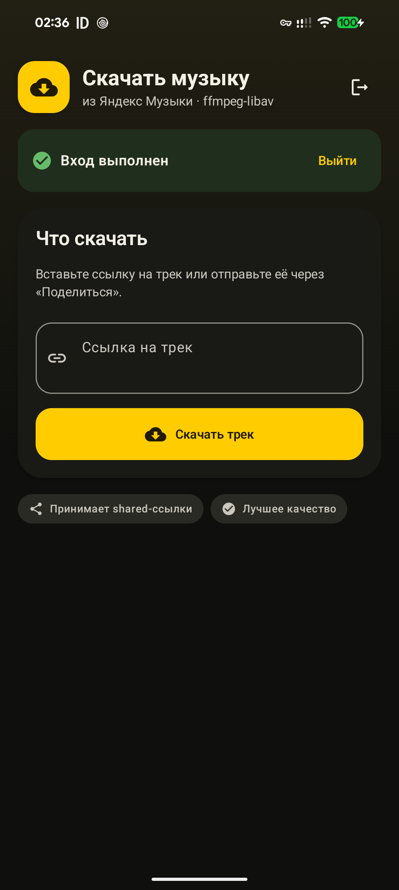
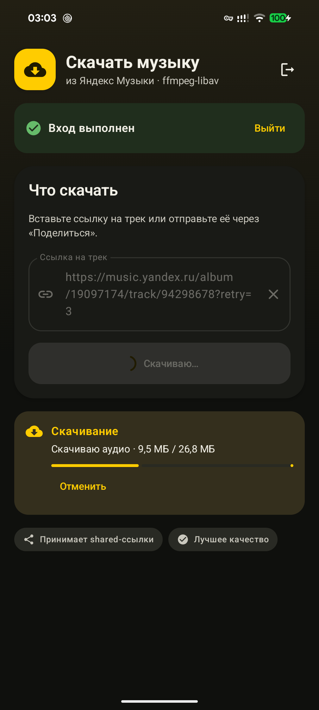

# ya-mus-downloader

Android client prototype for `yandex-music-api`. On first launch the app signs
the user in with Yandex OAuth Device Flow: authorization happens on Yandex's
official browser page and the access token is saved locally. The downloader UI
accepts links to tracks, albums, and playlists and saves the best available
quality into the public `Music/Ya Music` directory through Android MediaStore.
Each album and playlist gets its own directory; multi-disc albums also get
`CD1`, `CD2`, and subsequent subdirectories. A completed single track can be
sent immediately with the system Share sheet. Numeric IDs are deliberately
rejected.

Links can be pasted, shared to the application with Android `ACTION_SEND`, or
opened directly with `ACTION_VIEW`. A shared link is retained through sign-in
and starts automatically once authorization finishes.
The app also publishes a rank-0 Sharing Shortcut named `Скачать` for the Direct
Share row. Android retains final control over Sharesheet ordering; frequent use
or manually pinning the target can move it ahead of other applications.

The interface uses Jetpack Compose, Material 3, edge-to-edge drawing, and
`WindowInsets.safeDrawing`, so content stays outside camera cutouts, status
bars, and gesture navigation areas.

## Screenshots







Audio downloading, FLAC-in-MP4 container normalization, metadata and cover
embedding, transcoding, and complete validation run in Rust. The Android build
enables the library's in-process `media-ffmpeg` backend and statically builds
FFmpeg 8.1 through `ffmpeg-sys-next`; no `ffmpeg` executable is packaged or
launched.

The Settings tab contains an optional `MP3 instead of AAC/M4A` mode. When it is
enabled, AAC/M4A downloads are decoded and encoded locally as 320 kbit/s MP3 by
FFmpeg's `libmp3lame` encoder. FLAC and existing MP3 files are left unchanged.
The option is disabled by default because lossy-to-lossy transcoding cannot
improve the source quality and consumes additional time and battery.

The app uses the library's shared `downloader` pipeline. It displays real
downloaded and total byte counts when the CDN provides `Content-Length`, shows
normalization/tagging/verification phases, and can cancel an active request
while cleaning up its temporary file.
The download is owned by a foreground data-sync service rather than the
Activity, so it continues while the app is in the background. Its notification
mirrors progress and includes a cancel action.

`vendor/ffmpeg-sys-next` is based on release 8.1.0. Besides an Android tool
lookup fix (`Path::parent()` for `llvm-nm`/`llvm-strip`), it has a local
`build-lib-mp3lame` feature which passes the bundled LAME installation to
FFmpeg's build. `vendor/mp3lame-sys` is based on release 0.1.11 and includes
LAME 3.100.

## Build

Requirements:

- Rust 1.97 with `aarch64-linux-android` and `x86_64-linux-android`;
- Android SDK 37 and NDK 29.0.14033849;
- `cargo-ndk`;
- sibling checkout `../ya-music`.

```console
./gradlew assembleDebug
```

The first native build compiles LAME, clones and compiles FFmpeg, and therefore
takes longer.
The APK is written under `app/build/outputs/apk/debug/`.

The access token is encrypted with an app-specific AES-GCM key held by Android
Keystore; preferences contain only the IV and ciphertext, and Android backup is
disabled. The app never asks the user to copy or paste a token.

## Distribution note

FFmpeg and LAME are built as statically linked components of the native
library. Before distributing an APK outside private testing, review the LGPL
requirements for notices, corresponding source, and a way for recipients to
relink the application with modified versions of those libraries. The vendored
source trees include their upstream license files; this repository does not yet
claim to provide a complete binary-distribution compliance bundle.
